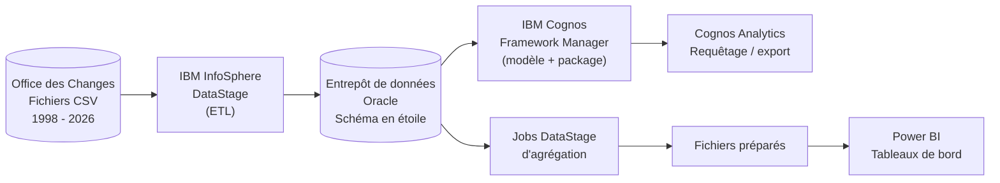
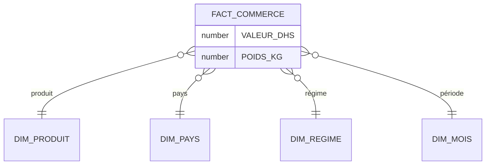

# 📊 Foreign-trade-bi-solution

Solution décisionnelle pour l'analyse des données du **commerce extérieur du Maroc** : de l'intégration des données jusqu'aux tableaux de bord interactifs.

Projet réalisé lors d'un stage d'étude d'un mois (1er – 31 juillet 2026) au sein du **Service Informatique de la Direction des Études et des Prévisions Financières (DEPF)** du Ministère de l'Économie et des Finances (Maroc).

---

## 🎯 Contexte et problématique

À la DEPF, l'analyse des données du commerce extérieur reposait principalement sur **Microsoft Excel** : traitements chronophages, réutilisation difficile, exploration limitée selon plusieurs axes d'analyse.

**Problématique :** comment intégrer, centraliser et automatiser le traitement des données du commerce extérieur afin de faciliter leur analyse et de soutenir la prise de décision ?

## ✅ Objectifs

- Développer des **processus ETL** pour extraire, transformer et charger les données ;
- Construire un **entrepôt de données** Oracle avec un **modèle multidimensionnel en étoile** ;
- Mettre en place une **couche de modélisation** (IBM Cognos Framework Manager) pour l'interrogation des données ;
- Concevoir des **tableaux de bord interactifs** (Power BI) pour suivre les indicateurs clés du commerce extérieur.

---

## 🏗️ Architecture globale

## 🗄️ Sources de données

Les données proviennent des statistiques officielles publiées par l'[Office des Changes du Maroc](https://www.oc.gov.ma/fr) (fichiers CSV).

- **Période couverte :** 1998 – 2026 (données 2026 provisoires, arrêtées à fin mars)
- **Fichiers exploités :** `Commerce` (valeur en DHS, poids en KG), `Produit`, `Pays`, `Temps`, `Régime`

> ℹ️ Les données brutes ne sont pas incluses dans ce dépôt en raison de leur volume : elles sont téléchargeables sur le portail de l'Office des Changes.

## ⭐ Modèle de données (schéma en étoile)

| Table | Rôle |
|---|---|
| `FACT_COMMERCE` | Table de faits : valeur (DHS) et poids (KG) des échanges |
| `DIM_PRODUIT` | Nomenclatures **SH** et **CTCI**, groupements d'utilisation, produits remarquables, branches d'activité |
| `DIM_PAYS` | Partenaires commerciaux, pays et continents |
| `DIM_REGIME` | Régimes / flux (importations, exportations, réexportations, admissions temporaires) |
| `DIM_MOIS` | Axe temporel (année, mois) |

---

## 📁 Contenu du dépôt

| Dossier | Contenu |
|---|---|
| [`architecture/`](architecture/) | Architecture globale de la solution et choix de conception |
| [`datawarehouse/`](datawarehouse/) | Modèle dimensionnel (dimensions, table de faits, schéma en étoile) et scripts SQL |
| [`etl/`](etl/) | Jobs IBM DataStage : alimentation des dimensions et de la table de faits, jobs d'agrégation |
| [`cognos/`](cognos/) | Modèle IBM Cognos Framework Manager : relations, cardinalités, package publié |
| [`power bi/`](power bi/) | Tableaux de bord, mesures DAX et indicateurs |

---

## ⚙️ Processus ETL (IBM InfoSphere DataStage)

Projet DataStage : `Commerce_Exterieur2026`.

**Jobs d'alimentation de l'entrepôt**

| Job | Description |
|---|---|
| Dimension Produit | Import de `DIM_CLASS_PRODUIT.xlsx`, normalisation des codes produits (Transformer), chargement Oracle |
| Libellés produit | Correction des libellés par Lookups, mise à jour Oracle (mode *Update*) |
| Branches d'activité | Ajout des branches d'activité pour l'analyse sectorielle |
| Dimensions Régime, Pays, Temps | Chargement direct des fichiers sources (Copy) |
| Table de faits `FACT_COMMERCE` | Lookup de l'identifiant du mois, traitement des codes SH |

**Jobs dédiés à la visualisation** : agrégations par *produit · régime · année*, *produit · pays · régime · année* et *branche d'activité · régime · année*, produisant les fichiers consommés par Power BI.

## 🧩 Modélisation (IBM Cognos Framework Manager)

Import des tables de l'entrepôt → organisation du diagramme et rôle des éléments (identificateurs, attributs, faits, indicateurs) → définition des cardinalités → validation → création et publication du **package** → requêtage via **Cognos Analytics** (export Excel / CSV).

## 📈 Tableaux de bord (Power BI)

| Tableau de bord | Contenu |
|---|---|
| Importations par groupement d'utilisation | Évolution 2016 – 2025, variations, structure |
| Exportations par groupement d'utilisation | Évolution 2016 – 2025, variations, structure |
| Importations par pays partenaires | Principaux fournisseurs du Maroc |
| Exportations par destination | Principaux clients du Maroc |
| Analyse comparative 2024 / 2025 | Importations, exportations, solde commercial, taux de couverture |
| Analyse sectorielle | Branches d'activité, arbre de décomposition, répartition par régime |

**Indicateurs clés (DAX) :** valeur de l'année précédente, importations, exportations, structure, variation annuelle, **solde commercial** (exportations − importations) et **taux de couverture** (exportations / importations).

<!--
APERÇU : après avoir ajouté vos captures dans le dépôt, décommentez ce bloc
et adaptez les chemins des images.

### 🖼️ Aperçu

-->

---

## 💡 Compétences mises en œuvre

`ETL` · `Data Warehouse` · `Modélisation dimensionnelle (schéma en étoile)` · `SQL / Oracle` · `IBM DataStage` · `IBM Cognos Framework Manager` · `Power BI` · `DAX` · `Data visualisation`

## 👩‍💻 Auteure

**Hajar GUEMILI** — Étudiante en 2ème année ACI, filière IIN — École des Sciences de l'Information (ESI), 2025/2026.

🔗 [LinkedIn](https://www.linkedin.com/in/hajar-guemili-b28900434/) · ✉️ hajarguemili5@gmail.com

## 📜 Licence et données

Code et documentation sous licence [MIT](LICENSE). Les données sources appartiennent à l'Office des Changes du Maroc et restent soumises à leurs conditions d'utilisation.
