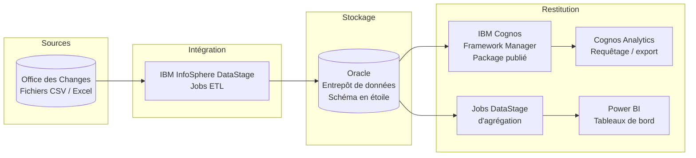

# 🏗️ Architecture de la solution

Ce dossier présente l'architecture globale de la solution décisionnelle dédiée à l'analyse des données du commerce extérieur du Maroc, ainsi que les choix de conception retenus.

## Vue d'ensemble

## Les couches de la solution

| Couche | Outil | Rôle |
|---|---|---|
| Sources | Office des Changes | Statistiques officielles du commerce extérieur (1998 – 2026) au format CSV |
| Intégration | IBM InfoSphere DataStage | Extraction, nettoyage, transformation et chargement des données |
| Stockage | Oracle (SQL Developer) | Entrepôt de données structuré en schéma en étoile, contrôle des données par requêtes SQL |
| Modélisation | IBM Cognos Framework Manager | Définition du modèle, des relations et publication d'un package |
| Restitution | Cognos Analytics, Power BI | Requêtage par les utilisateurs métier et tableaux de bord interactifs |

## Besoins auxquels répond l'architecture

- **Intégration et transformation** des données avant leur exploitation → DataStage
- **Stockage décisionnel** pour conserver et organiser les données destinées à l'analyse → Oracle
- **Interrogation** facilitée des données par les utilisateurs → Cognos Framework Manager / Cognos Analytics
- **Restitution et visualisation** adaptées aux besoins d'analyse → Power BI

## Choix de conception

**Un processus ETL automatisé.** Les traitements, auparavant réalisés manuellement sous Excel, sont désormais portés par des jobs DataStage réutilisables.

**Un schéma en étoile.** Une table de faits centrale reliée à quatre dimensions (produit, pays, régime, temps). Ce modèle a été préféré pour sa simplicité, sa facilité d'exploitation et son adéquation aux besoins d'analyse et de visualisation.

| Modèle | Principe | Retenu ? |
|---|---|---|
| Étoile | Une table de faits reliée directement aux dimensions | ✅ Oui |
| Flocon | Dimensions normalisées sur plusieurs tables (moins de redondance, plus de jointures) | Non |
| Constellation | Plusieurs tables de faits partageant des dimensions | Non |

**Deux voies de restitution complémentaires.**
- *Cognos* : les utilisateurs métier interrogent librement le modèle publié et exportent les résultats (Excel / CSV).
- *Power BI* : des jobs DataStage dédiés agrègent les données par axe d'analyse (produit, pays, branche d'activité) et produisent des fichiers légers consommés par les tableaux de bord.

## Navigation

| Dossier | Contenu |
|---|---|
| [`datawarehouse/`](../datawarehouse/) | Modèle dimensionnel |
| [`etl/`](../etl/) | Jobs DataStage |
| [`cognos/`](../cognos/) | Modèle Framework Manager |
| [`power bi/`](../power%20bi/) | Tableaux de bord et mesures DAX |

[← Retour au README principal](../README.md)
