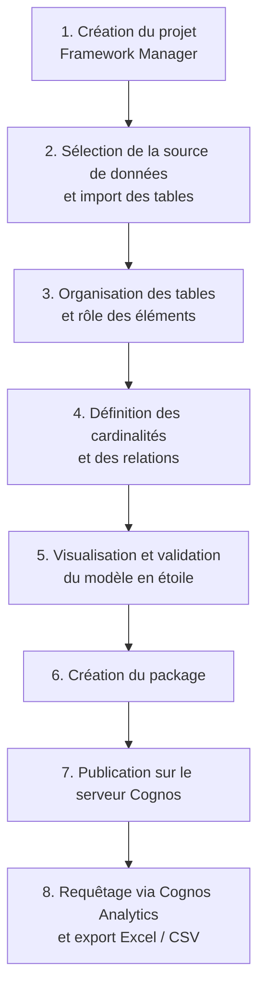

# 🧩 Modélisation avec IBM Cognos Framework Manager

Ce dossier présente la couche de modélisation construite au-dessus de l'entrepôt de données. **IBM Cognos Framework Manager** structure les tables du Data Warehouse, définit leurs relations et publie un modèle que les utilisateurs métier peuvent interroger.

## Objectif

Permettre aux utilisateurs d'accéder aux données selon les différents axes d'analyse du projet (temps, pays, produits, régimes) et de construire leurs propres requêtes, sans passer par les traitements ETL.

## Démarche

## Détail des étapes

| Étape | Description |
|---|---|
| **1. Création du projet** | Le projet Framework Manager sert d'environnement de travail pour construire le modèle. |
| **2. Source de données** | Connexion à l'entrepôt Oracle puis sélection des tables nécessaires (dimensions et table de faits). |
| **3. Organisation** | Les tables sont placées dans un diagramme. L'utilisation de chaque élément est définie selon son rôle : **identificateur**, **attribut**, **fait** ou **indicateur**. |
| **4. Cardinalités** | Définition des relations entre la table de faits et les dimensions pour garantir la cohérence des analyses. |
| **5. Validation** | Le modèle complet est visualisé : il correspond au schéma en étoile de l'entrepôt. |
| **6. Package** | Création du package qui met les données structurées à disposition des utilisateurs. |
| **7. Publication** | Publication du package sur le serveur Cognos. |
| **8. Requêtage** | Depuis le portail **IBM Cognos Analytics**, les utilisateurs sélectionnent les données à partir du package publié et construisent leurs requêtes. Les résultats peuvent être exportés au format Excel ou CSV. |

## Place dans l'architecture

Cognos constitue la voie d'**interrogation libre** des données. Les tableaux de bord prédéfinis sont réalisés séparément avec Power BI, à partir de fichiers agrégés par DataStage (voir [`power bi/`](../power%20bi/)).

## Voir aussi

- [`datawarehouse/`](../datawarehouse/) : le modèle dimensionnel importé dans Framework Manager
- [`etl/`](../etl/) : les jobs qui alimentent l'entrepôt

[← Retour au README principal](../README.md)
