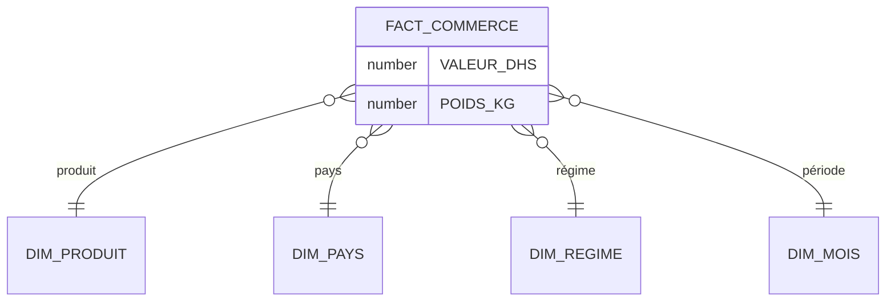

# 🗄️ Entrepôt de données (Oracle)

Ce dossier décrit la conception de la base de données décisionnelle : sources de données, dimensions, table de faits et schéma en étoile.

## Sources de données

Les données proviennent de la base du commerce extérieur de l'[Office des Changes du Maroc](https://www.oc.gov.ma/fr), publiée sous forme de fichiers CSV téléchargeables.

- **Période couverte :** 1998 – 2026 (données 2026 provisoires, arrêtées à fin mars)
- **Contenu :** opérations d'importation et d'exportation, analysables par produit, pays partenaire, période et régime

| Fichier | Contenu |
|---|---|
| `Commerce` | Fichier principal : mesures (valeur en DHS, poids en KG) et clés vers les dimensions |
| `Produit` | Informations descriptives et classifications des produits |
| `Pays` | Partenaires commerciaux |
| `Temps` | Informations temporelles |
| `Régime` | Régimes associés aux échanges commerciaux |

## Schéma en étoile



## Les dimensions

### Dimension Produit (`DIM_PRODUIT`)

Regroupe les informations descriptives des marchandises échangées, selon deux nomenclatures internationales complémentaires.

| Nomenclature | Niveaux exploités | Description |
|---|---|---|
| **SH** (Système Harmonisé, OMD) | Chapitre SH → Produit SH | Classification internationale des marchandises par codes normalisés |
| **CTCI** (Nations Unies) | Section → Division → Groupe | Regroupement des produits selon leur nature économique |

La dimension contient également :
- **Groupement d'utilisation** : biens de consommation, biens d'équipement, matières premières, produits énergétiques, etc.
- **Produits remarquables** : produits d'importance particulière faisant l'objet d'un suivi spécifique
- **Branches d'activité** : ajoutées dans un second temps pour permettre l'analyse sectorielle

### Dimension Régime

Distingue les différents flux associés aux échanges : importations, exportations, réexportations, admissions temporaires.

### Dimension Pays

Partenaires commerciaux du Maroc : axe d'analyse géographique par pays et par continent.

### Dimension Temps (`DIM_MOIS`)

Permet de suivre l'évolution des échanges et de comparer différentes périodes (année, mois).

## Table de faits (`FACT_COMMERCE`)

Contient les **mesures** (valeur en DHS, poids en KG) ainsi que les **clés** reliant chaque enregistrement aux dimensions Produit, Pays, Régime et Temps.

## Contrôle des données

Après chaque chargement, les données sont vérifiées dans **Oracle SQL Developer**. Exemples de contrôles de volumétrie :

```sql
SELECT COUNT(*) FROM FACT_COMMERCE;
SELECT COUNT(*) FROM DIM_PRODUIT;
SELECT COUNT(*) FROM DIM_MOIS;
```

## Alimentation

L'entrepôt est alimenté par des jobs IBM DataStage : voir le dossier [`etl/`](../etl/).

[← Retour au README principal](../README.md)
