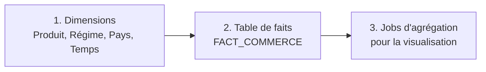

# ⚙️ Processus ETL (IBM InfoSphere DataStage)

Ce dossier documente les traitements ETL qui alimentent l'entrepôt de données Oracle à partir des fichiers de l'Office des Changes, puis préparent les données destinées à la visualisation.

## Organisation du projet DataStage

- **Projet :** `Commerce_Exterieur2026`
- **Connexion à la base :** `Connexion_BD`, créée une fois et réutilisée dans les différents jobs
- **Table definitions :** définitions des tables Oracle, utilisées comme sources dans certains jobs
- **Sources :** fichiers téléchargés depuis le site de l'Office des Changes et regroupés dans un dossier dédié

## Composants utilisés

| Composant | Utilisation |
|---|---|
| Fichier source (CSV / Excel) | Lecture des données de l'Office des Changes |
| Transformer | Contrôle et formatage des codes (produits, SH) |
| Lookup | Récupération d'informations dans les tables de référence |
| Copy | Transfert direct des données vers la sortie |
| Aggregator | Calcul des valeurs agrégées pour la restitution |
| Connecteur Oracle | Lecture (requête SQL `SELECT`) et écriture dans la base, modes *Insert* et *Update* |

## Ordre d'exécution

## 1. Jobs d'alimentation de l'entrepôt

### Dimension Produit

Trois jobs successifs :

| Job | Description |
|---|---|
| **Alimentation** | Lecture du fichier `DIM_CLASS_PRODUIT.xlsx`. Un *Transformer* contrôle la longueur des codes produits et ajoute des zéros à gauche lorsqu'elle est inférieure à la longueur attendue. Les données sont chargées dans la table `DIM_PRODUIT` via le connecteur Oracle. |
| **Traitement des libellés** | Correction des libellés. `DIM_PRODUIT` est relue à l'aide d'une requête SQL `SELECT`, plusieurs *Lookups* récupèrent les informations de référence (chapitres, groupements d'utilisation, classifications CTCI), puis les enregistrements existants sont modifiés en mode *Update*. |
| **Mise à jour** | Ajout des données relatives aux **branches d'activité**, utilisées pour l'analyse sectorielle dans les tableaux de bord. |

### Dimensions Régime, Pays et Temps

Ces dimensions n'ont nécessité aucune transformation spécifique : le fichier source est lu puis transféré vers Oracle à l'aide du composant *Copy*.

### Table de faits `FACT_COMMERCE`

Job exécuté après l'alimentation des dimensions :
- un *Lookup* récupère l'identifiant du mois à partir de l'année et du mois (table `DIM_MOIS`) ;
- un *Transformer* traite les codes SH dont la longueur est inférieure à dix caractères ;
- les données sont chargées dans `FACT_COMMERCE`.

## 2. Jobs dédiés à la visualisation

Une fois l'entrepôt alimenté, trois jobs préparent les fichiers exploités par Power BI. Chacun lit `FACT_COMMERCE`, enrichit les données par *Lookups* sur les dimensions, agrège avec un *Aggregator*, puis écrit un fichier de sortie.

| Job | Axes d'agrégation | Dimensions jointes |
|---|---|---|
| Agrégation 1 | Produit · Régime · Année | Produit, Régime, Temps |
| Agrégation 2 | Produit · Pays · Régime · Année | Produit, Pays, Régime, Temps |
| Agrégation 3 | Branche d'activité · Régime · Année | Produit (branches d'activité), Régime, Temps |

Les fichiers obtenus alimentent les tableaux de bord du dossier [`power bi/`](../power%20bi/).

## Bonnes pratiques

- Les paramètres de connexion Oracle sont centralisés dans `Connexion_BD` plutôt que saisis dans chaque job.
- Aucun identifiant ni mot de passe ne doit figurer dans les fichiers de ce dépôt.

[← Retour au README principal](../README.md)
