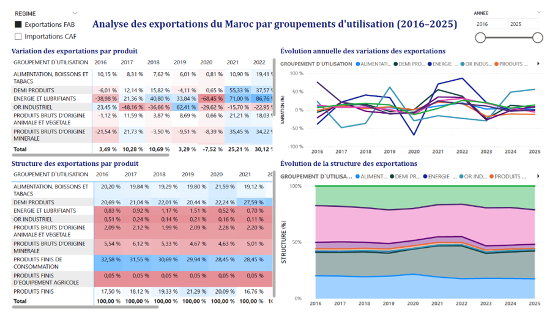
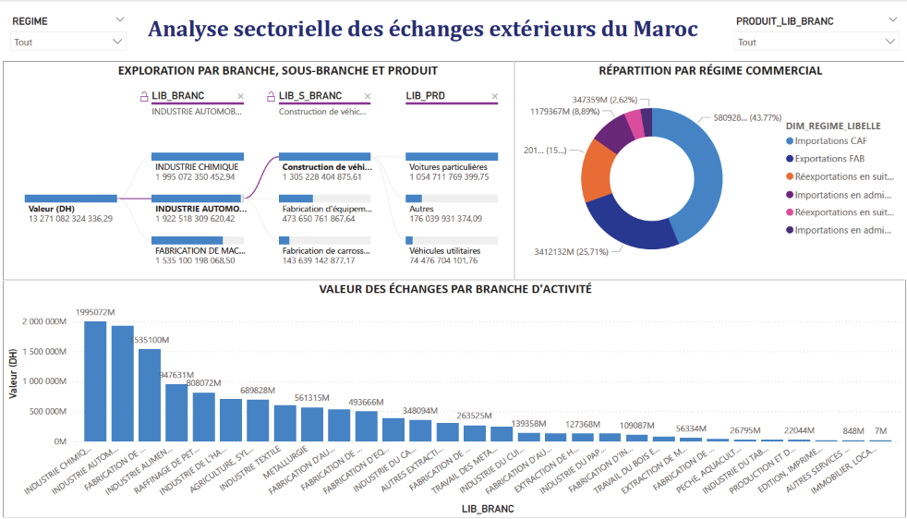
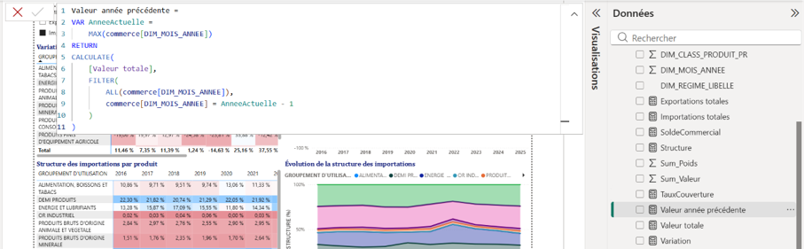
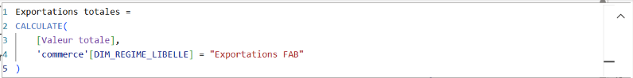
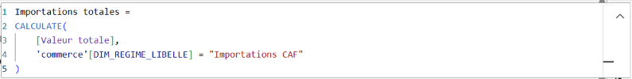
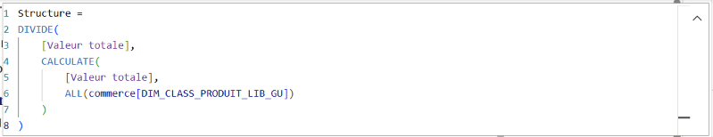
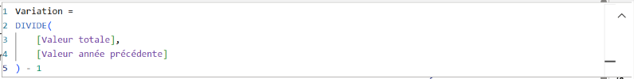
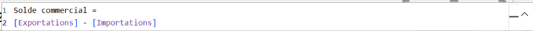
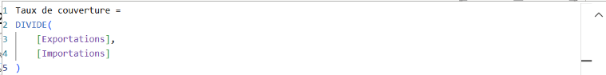

# 📈 Power BI : tableaux de bord du commerce extérieur

Ce dossier présente les tableaux de bord Power BI réalisés à partir des fichiers préparés par les jobs d'agrégation DataStage (voir le dossier `etl`). Ils permettent d'analyser les échanges commerciaux du Maroc selon plusieurs axes : produits, pays partenaires, régimes, branches d'activité et périodes.

## 🖼️ Tableaux de bord

### 1. Importations par groupement d'utilisation (2016 – 2025)
Évolution des importations, variations annuelles et poids relatif de chaque groupement d'utilisation.

### 2. Exportations par groupement d'utilisation (2016 – 2025)
Même analyse pour les exportations.

### 3. Importations par pays partenaires
Identification des principaux fournisseurs du Maroc et de l'évolution de leur contribution.

### 4. Exportations par destination
Identification des principaux clients du Maroc.

### 5. Analyse comparative 2024 / 2025
Importations, exportations, **solde commercial** et **taux de couverture**, avec la variation entre les deux années.

### 6. Analyse sectorielle
Échanges par branche d'activité, arbre de décomposition (branche → sous-branche → produit) et répartition par régime commercial.

## 🧮 Mesures DAX

| Mesure | Rôle |
|---|---|
| Valeur de l'année précédente | Base de calcul des variations annuelles |
| Exportations | Total des exportations |
| Importations | Total des importations |
| Structure | Poids relatif d'une catégorie dans le total |
| Variation | Évolution par rapport à l'année précédente |
| Solde commercial | Exportations − Importations |
| Taux de couverture | Exportations / Importations |

### Valeur de l'année précédente

### Exportations

### Importations

### Structure

### Variation

### Solde commercial

### Taux de couverture

